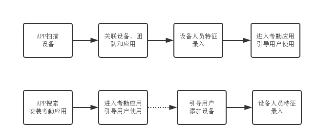
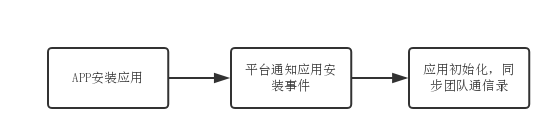
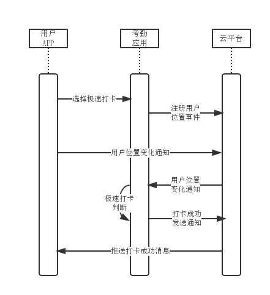

## 文档目标

本文档用于描述得力云平台考勤机设备与云端考勤应用接入的标准方式、数据交换协议以及具体的接口定义。

## 适用范围

本文档用于说明得力云平台对外提供的云考勤机设备和云端考勤应用服务接入方式，帮助和指导智能云考勤相关开发人员正确接入云平台。

## 云考勤接口设计

- ### 接入流程

云考勤接入主要有两种途径:

    1.  一是通过扫描设备，然后绑定云端考勤应用服务;
    2.  二是直接在App应用市场搜索并添加应用服务，然后扫描添加设备。

云考勤机在添加到应用服务时，需要进行初始化，将考勤人员以及人员的指纹、人脸、密码等特征信息录入到设备当中。如果之前已有相同配置型号的考勤机，那么新的考勤机中如果有部分人员之前已录入个人特征信息，应自动完成同步，不需要重复录入。



- ### 云考勤机功能

云考勤机对比传统考勤机而言，业务功能更为简单，不需要在设备端实现复杂的人员管理、考勤规则设置，所有考勤管理相关操作都在云端应用服务完成，考勤机仅需要实现以下功能即可:

    1.  考勤人员同步;
    2.  指纹/人脸等人员特征信息录入上传；
    3.  考勤机打卡记录上传；
 
下面就具体的功能接口进行说明。

+ #### 考勤机升级

请参考通用设备接入[指令103](../../general/device/#103)以及[指令202]((../../general/device/#202)。设备升级分为两个场景:

    1. 主动升级: 设备定时通过102指令查询平台最新固件版本，如果版本不一致，则通过103指令查询最新版本信息，并按照本地升级策略进行升级操作;
    2. 被动升级: 设备在线接收平台广播202指令升级信息，如果版本不一致，则通过103指令查询最新版本信息，并按照本地升级策略进行升级操作；

+ #### 考勤人员同步

考勤人员同步是指考勤机初始化时选择参与考勤的人员，该部分工作由云端应用独立完成，平台不参与。

当用户在云端应用页面选择参与考勤的人员列表后，云端应用需要主动通知考勤机有人员更新，考勤机设备判断是否需要更新数据数据，如果需要则发起增量更新请求，告知云端应用需要更新的条目数量以及上次更新的时间戳。云端应用收到增量更新请求后，将人员增量更新信息再推送给考勤机。

注意，设备和应用之前的消息转发需要通过平台进行中转。其中设备发给应用的消息，使用[指令300](../../general/device/#300)，然后经过平台中转为[指令405](../../general/app/#405)到达应用服务。同样，应用服务发给设备的消息，使用[指令500](../../general/app/#500)，然后由平台中转为[指令301](../../general/device/#301)到达设备。

云端应用通过设备信息推送指令500通知考勤机，请求示例如下:

```json
{
    "mid": "123456", 
    "from": "云端应用ID", 
    "to": "设备ID", 
    "time": 1502867086, 
    "action": 500, 
    "data": {
        "cmd": "user_update",
        "payload": {
            "update_time": 1502867086000
        }
    }
}
```
其中, `update_time`表示本次更新的时间戳（精确到毫秒），如果设备多次收到更新请求，可通过该时间戳判断本地是否需要发起增量更新。

设备收到该考勤人员更新通知后，主动发起增量同步请求，请求示例如下:
```json
{
    "mid": "123456", 
    "from": "设备ID ", 
    "to": "云端应用ID ", 
    "time": 1502867086, 
    "action": 405, 
    "data": {
        "cmd": "user_sync", 
        "payload": {
            "size": 10,
            "update_time": 1502867086000
        }
    }
}
```

增量同步时，可以设置本次同步的条目数`size`, 同时也应告知应用服务器上次同步的时间戳`update_time`, 精确到毫秒。

云端应用收到该同步请求后，推送增量的考勤人员信息到设备:
```json
{
    "mid": "123456", 
    "from": "云端应用ID ", 
    "to": "设备ID", 
    "time": 1502867086, 
    "action": 500, 
    "data": {
        "cmd": "user_sync", 
        "payload": [
            {
                 "user_id": 10000, 
                 "name": "张三", 
                 "fp": "指纹", 
                 "fa": "人脸"
            },
            {
                ......
             }
        ]
    }
}
```

`fa`和`fp`是在云应用中已存在相关可用信息时直接发送给设备。


+ #### 考勤人员特征信息录入

考勤设备绑定后，云端应用需要引导管理人员进行考勤人员指纹或人脸等特征数据的录入。具体考虑设备支持哪些特征数据，平台会在设备绑定时通过webhook告知应用，对应[指令402](../../general/app/#402)。

该部分工作由云端应用独立完成，平台不参与，但是云端应用需要及时将用户的特征数据同步至平台。

云端应用通过设备信息推送[指令500](../../general/app/#500)向考勤机发起请求，请求示例如下:
```json
{
    "mid": "123456", 
    "from": "云端应用ID", 
    "to": "设备ID", 
    "time": 1502867086, 
    "action": 500, 
    "data": {
        "cmd": "feature_input", 
        "payload": {
            "user_id": 10000，
            "feature_type": "fa|fp"
        }
    }
}
```

其中`user_id`标识当前需要录指纹的用户ID，`feature_type`标识需要录入的用户特征数据类型（人脸为fa，指纹为fp）。

设备收到请求后，启动指纹或人脸等特征录入流程。录入完成后，设备应通过应用消息推送[指令300](../../general/device/#300)将用户特征编码信息上传云端应用保存。

指纹特征上传请求示例如下:
```json
{
    "to": "发起应用服务ID", 
    "time": 1502867086, 
    "action": 300, 
    "data": {
        "cmd": "fp_input", 
        "payload": {
            "user_id": 10000, 
            "fp_data": "指纹特征值"
        }
    }
}
```
云端应用需在收到用户特征编码信息后同时通过用户信息上报[指令600](../../general/app/#600)上传到云平台，用于后续多设备共享使用。
请求示例如下:
```json
{
    "from": "发起应用服务ID", 
    "time": 1502867086, 
    "action": 600, 
    "data": {
        "user_id": 用户ID, 
        "client_type": "device", 
        "client_id": "考勤机ID", 
        "event_type": "user_feature_input", 
        "event_data": [
            {
                "feature_type": "fp", 
                "feature_value": "dsjkjsjsjdkadladldsas..."
            }
        ]
    }
}
```
其中各参数说明如下:

|请求参数|描述|
|----|----|
|user_id|用户ID|
|client_type|device，表示来自设备的数据|
|client_id|用户正在使用的考勤机设备ID|
|event_type|事件类型：**user_feature_input**标识当前事件类型为用户特征信息录入|
|event_data|事件所产生的数据。 <br>*feature_type：fp, 标志是指纹录入、fa标志是人脸录入*, <br>*feature_value:对应特征值*|


+ #### 考勤机远程配置

用户可以通过云端应用远程查询和更改设备的相关配置信息，例如设备名称、设备音量等等。请参考[指令500](../../general/app/#500)和[指令405](../../general/app/#405)，并结合设备的实际功能配合`cmd`参数进行实现。

+ #### 考勤机打卡

员工通过设备进行密码、指纹或人脸考勤打卡时，设备需将打卡数据通过指令300发送至云端应用，为了降低上传频率，设备可定时批量提交考勤记录。
云端应用需要及时将用户的打卡数据同步至平台。

设备打卡数据上传可使用应用消息推送[指令300](../../general/device/#300)来完成，上传内容格式设计如下:
```json
{
    "mid": "123456", 
    "from": "设备ID", 
    "to": "应用服务ID", 
    "time": 1502867086, 
    "action": 300, 
    "data": {
        "cmd": "checkin", 
        "org_id": "组织ID", 
        "users": [
            {
                "user_id": 1, 
                "feature_type": "fp", 
                "time": 1503025335
            }, 
            {
                "user_id": 2, 
                "feature_type": "fa", 
                "time": 1503028318
            }
        ]
    }
}
```

各请求参数说明如下:

|请求参数|描述|
|----|----|
|cmd|checkin命令表示员工打卡|
|users|表示一批员工打卡记录。其中各属性说明如下:<br>*user_id：用户ID*，<br>*feature_type：考勤方式*,<br>*time：考勤时间（精确到秒）*|

如果上传不成功，设备应后续等待一段时间继续尝试，直到上传成功为止。

云端应用需在收到打卡数据后同时通过用户信息上报[指令600](../../general/app/#600)上传到云平台，上传请求如下:
```json
{
    "from": "发起应用服务ID", 
    "time": 1502867086, 
    "action": 600, 
    "data": {
        "user_id": "用户ID", 
        "client_type": "device", 
        "client_id": "设备ID", 
        "event_type": "user_checkin", 
        "event_data": {
            "id_type": "fp", 
            "time": 1234567890
        }
    }
}
```
其中各参数说明如下:

|请求参数|描述|
|----|----|
|user_id|用户ID|
|client_type|用户数据产生设备类型：device表示考勤机设备。如果是手机打卡，则应为ios或者android|
|client_id|用户正在使用的设备ID|
|event_type|事件类型：**user_checkin**标识当前事件类型为用户考勤打卡|
|event_data|事件所产生的数据：<br>*id_type: 表示考勤方式*，<br>*time: 表示考勤时间*|


- ### 云考勤应用功能

考勤应用的功能参照主流云考勤系统，应至少具备以下功能:

    1. 考勤排班管理；
    2. 考勤规则设置；
    3. 考勤相关申请审批，例如补卡、加班、请假、出差等
    4. 考勤报表统计分析
    5. 其他特殊功能，例如极速打卡

以上功能应在APP手机端和Web分别针对终端用户和管理员进行实现，具体实现细节，这里不阐述。

为了便于考勤应用实现上述功能，平台应提供以下接口实现:

+ ####  应用安装通知

在组织管理员通过设备扫描或者主动安装应用时，平台会主动通过WebHook回调通知应用用户安装事件，回调应用指令为[400](../../general/app/#400)。
考勤应用收到安装事件后，应启动初始化，通过数据同步[指令507](../../general/app/#507)开始同步组织数据。如果之前已有组织信息，可通过`update_time`参数进行增量同步。



同样，当用户卸载删除了应用时，平台也会主动通知应用进行相应的数据清理操作，具体指令为[401](../../general/app/#401)。

+ ####  设备绑定通知

当应用绑定或者解绑某台考勤机设备时，平台会通过指令[402](../../general/app/#402)和[403](../../general/app/#403)回调通知应用服务，应用服务可进行相应的处理操作。

+ ####  设备状态更新

平台会通过应用端回调[指令404](../../general/app/#404)同步设备状态到云端应用，包括设备的在线、离线等。云端应用根据业务实际需求来更改内部设备状态。

+ ####  JSAPI接口

云端应用以网页方式嵌入APP时，需要通过原生APP访问相关数据，因此，需要提供基于JS的一套API库方便应用调用，具体接口定义见[《第三方云应用JS-SDK API说明》文档](../../general/jssdk/)。

+ ####  APP消息推送

应用服务可通过平台向终端用户APP推送消息和代办事项。目前考勤里面应该两种都会存在，例如打卡提醒是消息，补卡申请是代办。

具体接口实现可参考应用接入协议指令[501](../../general/app/#501)、[502](../../general/app/#502)和[503](../../general/app/#503)。

+ ####  极速打卡

为了更方便的实现员工快速打卡，平台应支持在特定排班时间段，考勤云应用未启动的状况下完成打卡，包括:

    1. 极速wifi打卡，当用户处于某个wifi热点范围内时，自动完成打卡；
    2. 极速GPS定位打卡，当用户处于某个GPS位置附近时，自动完成打卡；
    3. 极速蓝牙打卡，当用户处于某个支持蓝牙考勤的考勤机附近时，自动完成打卡；

当用户选择极速打卡时，考勤应用应通过[指令505](../../general/app/#505)向平台注册用户相应的事件监听，平台随后会将相应的事件信息通过Webhook同步到考勤应用服务，由考勤服务决定是否极速打卡成功。
如果极速打卡成功，考勤应用应通过平台[指令501](../../general/app/#501)通知应用考勤成功。具体操作流程如下:




## 其它

- ### 更新日志

  ** 1.0 (2017-10-24) **

  + 发布1.0线上版本


