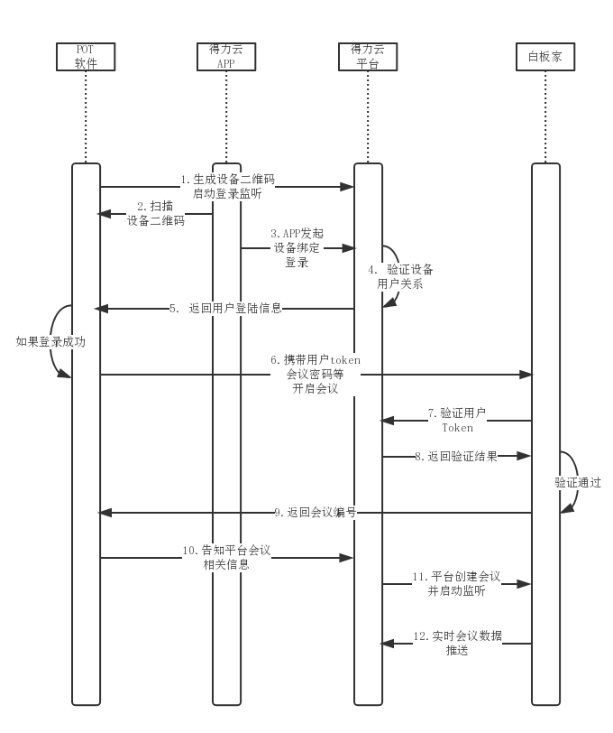

## 文档目标
本文档用于描述PPT智能翻页笔接入得力云平台的标准方式、数据交换协议以及具体的接口定义。

## 适用范围
本文档用于描述得力云平台与PPT智能翻页笔中自带的POT软件的业务对接方式，帮助和指导POT软件相关开发人员正确接入云平台。

## 接口设计

- ### 业务流程

得力PPT智能翻页笔在使用POT软件会议分享功能前，需要用户先下载得力APP注册得力账户，通过得力APP提供的扫码功能，扫描POT软件自动生成的设备二维码完成设备验证和用户绑定方可使用。
登录成功后，平台将自动完成用户和翻页笔的用户绑定关系，所有用户会议资料数据将在平台自动保存，方便用户后续通过得力APP查看。

一旦POT软件完成绑定，其他用户账户将无法扫码登录（除非在得力APP中将该翻页笔转入组织，那么组织所有人都可以使用）。使用免登模式仍可开启会议，但会议资料不会自动保存到云端。
POT软件登录云平台成功后，后续会议功能将由白板家会议系统提供支持。白板家服务器通过得力云平台验证用户身份，得力云平台通过白板家服务器接口获取会议数据保存到云端。
整个基本的业务流程如下:



- ### 通信方式

参考[设备标准接入协议](../../general/device)，POT软件作为虚拟设备接入端，也采用MQTT协议与设备网关进行通信完成所有通信操作，相当于POT软件是设备的固件程序。

- ### 平台接口定义

+ #### 设备接入

POT软件运行于PC端，无需通过APP进行配网操作，POT软件启动后应自动通过MQTT协议向平台发起连接进行接入。具体接入方式参见标准设备接入协议文档相应章节。

+ #### 设备查询

POT软件本身并不存储设备绑定相关信息，需要通过标准设备查询[指令102](../../general/device/#102)查询设备当前状态，进行相关业务逻辑展示。例如未绑定设备应提示用户绑定，已绑定设备应展示绑定组织信息等。

+ #### 用户APP登录

POT软件在开始会议前，需要用户通过得力APP扫码的方式进行登录授权操作，登录成功后云平台会返回授权用户相关信息，具体返回内容见[指令205](../../general/device/#205)。

POT软件生成的登录二维码格式如下:

** `http://qr.delicloud.com?from=device&action=login&product={产品型号}&device={设备ID}&conntype=auto` **

其中`from`和`action`是固定不变的，后面`product`和`device`则根据实际情况填写即可。

用户授权信息可保存到本地，用于下一次自动登陆。另外`expire`信息表示`token`失效的时间，毫秒为单位。一旦`token`失效，则需要重新授权登陆。

+ #### 用户服务器认证

如果白板家服务器后台需要再次验证用户身份，可使用之前APP登录的`user_id`、`token`与平台服务器通信完成再次身份验证，并获取用户基本信息。参考[指令509](../../general/app/#509)。

+ #### 免登模式

为了便于POT软件的使用，POT软件可不经过用户APP登录授权直接使用POT会议系统。此时相当于访客模式，`user_id`和`token`信息可直接为空，白板家服务器也不需要到得力云平台进行用户身份认证。

+ #### 会议启动

当用户登录成功后，POT会生成会议信息，包括会议编号、密码等，POT需要同步将该信息发送给得力云平台对应的会议服务，告知会议已启动，随后平台后端会议服务开始与白板家服务器通信同步监听获取会议信息。

POT软件相当于与平台后端会议应用进行通信，操作[指令300](../../general/device/#300)，请求内容如下:
```json
{
    "mid": "123456", 
    "to": "会议服务ID", 
    "time": 1502867086, 
    "action": 300, 
    "data": {
        "cmd": "startmeeting", 
        "payload": {
            "user_id": "用户ID", 
            "token": "用户token", 
            "meetno": "会议编号", 
            "meetpass": "会议密码明文或空", 
            "nickname": "会议昵称"
        }
    }
}
```
如果是免登模式，`user_id`及`token`等信息不填。如果平台响应失败，则直接返回错误码。

正常情况下，平台后端会议应用会同步生成会议，并返回会议二维码文本。该二维码可用于微信公众号扫码加入会议，也可以用于得力APP扫码加入会议。
云端应用返回响应数据采用[指令301](../../general/#301)，响应数据格式如下:
```json
{
    "mid": "123456", 
    "from": "应用服务ID", 
    "time": 1502867086, 
    "action": 301, 
    "data": {
        "cmd": "startmeeting", 
        "payload": {
            "qrcode": "http://weixin.qq.com/q/02lIgFJxgoft31ssef1o1S"
        }
    }
}
```
`qrcode`是得力会议微信公众号生成的临时二维码URL，方便通过微信直接扫描进入公众号会议系统。

POT软件得到二维码信息后，需要自行根据该文本链接生成二维码图像。

** 注意: 如果POT软件请求得力云平台监听会议失败，开始会议按钮应不可用，同时POT软件应定时重复发送请求，直到成功为止。请求的时间间隔不低于1秒。**

+ #### 其他设备接口

如果POT软件需要支持其他设备接口，例如主动解除绑定，请直接参考标准接入协议其它相关指令。

- ### 白板家接口支持

目前白板家提供的POT SDK已基本符合会议监听需求。


## 其它

- ### 更新日志

  ** 1.0 (2017-10-25) **

  + 发布1.0线上版本


