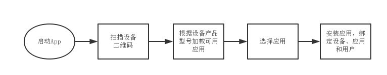
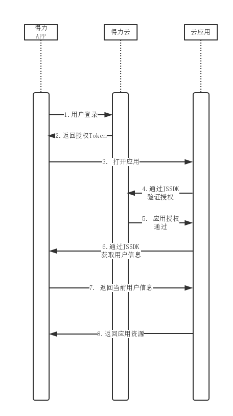
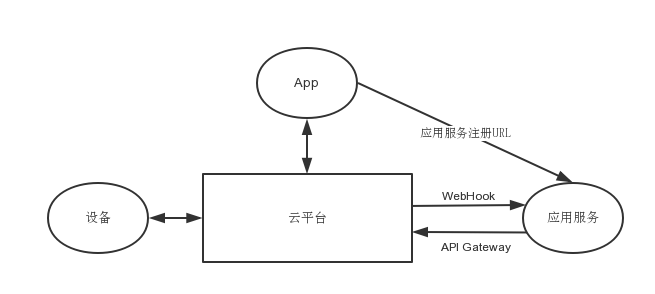

## 文档目标

本文档用于描述得力云平台云端应用服务接入的通用标准方式、通信协议以及具体的接口定义，不涉及具体某种类型应用的业务操作协议。

## 适用范围

本文档用于说明得力云平台对外提供的应用服务接入方式，帮助和指导云端应用服务开发人员正确接入云平台。

## 相关术语

|术语|解释|
|----|----|
|智能设备|是指任何一种具有计算处理能力的设备、器械或者机器，智能设备通过网络与云平台连接，实现设备和云端软件服务的集成|
|云平台|各种智能设备和应用服务接入的基础服务平台，为智能设备和云端应用进行接入和数据交换提供支撑|
|应用服务|为智能设备提供增值服务的云端软件应用|


## 应用接入设计

- ### 应用注册

任何云端应用服务需要提前在得力云平台进行注册，注册时需要提供以下信息:

    1.   应用服务名称
    2.   应用服务图标
    3.   应用服务效果截图（至少4张）
    4.   App端访问的URL地址
    5.   Web端访问的URL地址
    6.   平台服务器回调的WebHook地址
    7.   联系人信息
    8.   可以支持的设备产品型号列表

其中: 第4项App访问地址是指通过得力手机App打开应用是访问的链接地址，第5项是后台Web管理端访问的链接地址，第6项是指平台主动通知应用服务时的回调WebHook接口地址。

注意: **目前得力云平台并未对外开放注册，所以云端开发者需要将相关信息提交给平台管理人员，由平台管理人员备案注册 **。

应用注册完成后，平台会提供分配给应用的唯一的`appId`和`appKey`。后续平台与服务之前的通信将通过该信息进行身份识别和签名。同时，应用在审核发布后，也会出现在得力App的应用列表中供用户查看安装。


- ### 应用安装

应用服务可以通过以下两种途径被用户安装使用:

    1.   通过App应用市场或，用户搜索然后点击安装；
    2.   通过智能设备扫码绑定时，用户选择可以配套使用的应用服务；

对于第二种方式，平台会根据应用注册时提供的支持设备产品型号列表进行筛选。


不论哪种方式，应用安装成功后，即出现在用户App的应用列表中，点击应用即可访问注册时提供的URL地址。

- ### 应用授权

用户登录APP之后，通过App访问云端应用服务的Web页面时，云端应用会加载得力云JS SDK的初始化API进行应用授权验证，验证通过后，应用即可通过JS SDK提供的用户API接口获取当前用户的相关信息，并返回应用界面资源。
整个授权流程如下:


下一章节会对接口进行具体说明。

- ### 其他说明

出于灵活性考虑，APP内所有云端应用都应基于HTML5网页开发，除非经过授权，云端应用无法直接访问平台内的数据，但允许应用通过平台提供的JS SDK开放的接口访问原生APP提供的部分功能和接口。

具体JS SDK提供的功能列表见[《第三方云应用JS-SDK API说明》文档](../../general/jssdk/)。


## 应用服务接口

为了满足应用服务的业务需求，平台提供了一系列的接口方便应用与设备、平台以及终端App用户进行信息交互。

### 通信协议

考虑到云端应用服务的多样性，所有云端应用服务统一采用HTTP协议+JSON数据交换格式与平台API Gateway服务网关进行通信，由平台根据请求类型的不同进行消息路由。
同样，应用服务提供的Web Hook回调接口也采用相同的方式处理。


下面分别就应用服务WebHook回调接口和平台开放的API Gateway接口进行详细说明。

### WebHook回调接口

如果需要推送消息给应用服务，必须统一调用应用服务注册的WebHook回调URL地址完成。平台目前仅支持**HTTP/HTTPS**协议的回调地址。

平台调用WebHook回调接口统一采用**POST**方式发起请求，请求参数采用JSON格式数据提交。请求参数格式如下:
```json
{
    "mid": "消息ID", 
    "from": "请求方ID", 
    "to": "应用服务ID", 
    "time": 请求时间, 
    "action": 请求指令, 
    "data": {操作内容}, 
}
```
各请求参数说明如下:

|请求参数|描述|
|----|----|
|mid|消息ID，用来标识一次消息请求上下文，内容自定义|
|from|发送方ID，根据消息类型ID含义不同|
|action|平台操作指令|
|time|消息发送时间（秒）|
|data|具体的消息数据内容，统一为JSON格式|

出于安全考虑，平台发送给服务的回调请求应进行数字签名，服务可对签名进行验证，防止非法请求。签名的计算方式如下:

** `sig = MD5(action + from + to + appKey + time)` **

其中签名用的`appKey`是由应用服务注册时生成，如果某个签名字段为NULL，则按空字符串处理即可。`sig`生成后放到HTTP的请求头部（Request Header）中，与请求参数一同发送给服务。

WebHook接口调用是否成功以HTTP响应状态码来判断。如果是200则表示成功，其他均表示失败。如果失败，平台会按照一定的规则重新定时发起重试，最多尝试次数为**30**次,每次尝试时间间隔会根据次数递增。

目前平台消息推送的通用WebHook请求有如下几种:

+ #### <span id="400">应用安装400</span>

通过该指令平台通知应用服务某个人或企业组织安装了此应用。
推送消息格式如下:
```json
{
    "action": 400, 
    "to": "应用服务ID", 
    "time": 1503025335, 
    "data": {
        "org_id": 用户组织ID,
        "name": "组织名称",
        "logo": "组织logo URL地址",
        "org_admin": {
            "user_id": 组织管理员ID, 
            "name": "姓名", 
            "empno": "工号", 
            "avatar": "头像URL"
        },
    }
}
```
其中`data`部分的各属性说明如下:

|属性|描述|
|----|----|
|org_id|应用绑定组织ID|
|name|组织名称|
|logo|组织LOGO图片URL|
|org_admin|组组管理员信息|

+ #### <span id="401">应用卸载401</span>

通过该指令通知应用服务某个用户或组织卸载了此应用，该指令与[400](#400)向对应。

推送消息格式如下:
```json
{
    "action": 401, 
    "to": "应用服务ID", 
    "time": 1503025335, 
    "data": {
        "org_id": "用户组织ID"
    }
}
```

其中，`org_id`表示卸载应用的目标用户组织。

+ #### <span id="402">设备绑定402</span>

通过该指令平台通知应用服务某个人或企业组织绑定一台新设备。
推送消息格式如下:
```json
{
    "action": 402, 
    "to": "应用服务ID", 
    "time": 1503025335, 
    "data": {
        "org_id": "组织ID", 
        "device_id": "设备ID", 
        "name": "设备名称", 
        "status": 0|1,
        "product": {
            "model": "产品型号", 
            "name": "产品名称", 
            "type": "产品类型", 
            "icon": "产品图标URL地址", 
            "features": [ {
                "type": "特征类型",
                "value": "特征参数值",
            }]
        }
    }
}
```
各响应参数说明如下:

|响应参数|描述|
|----|----|
|org_id|设备所属组织ID|
|device_id|设备ID|
|name|设备名称|
|status|设备状态，0表示离线，1表示在线|
|product|产品信息。包括: *<br>model:产品型号,<br>name:产品名称, <br>type:产品类型,<br>icon:产品图标URL,<br>features:产品特征列表，包括特征类型type（例如支持人脸、指纹），特征参数value（例如人脸算法版本等）*|


+ #### <span id="403">设备解绑403</span>

通过该指令平台通知应用服务某个人或企业组织解绑一台现有设备。
推送消息格式如下:
```json
{
    "action": 403, 
    "to": "应用服务ID", 
    "time": 1503025335, 
    "data": {
        "device_id": "设备ID",
        "org_id": "个人或组织ID",
    }
}
```

+ #### <span id="404">设备状态更新404</span>

通过该指令平台通知应用服务某台现有设备的上下线状态。`status`等于0表示离线，1表示在线。
推送消息格式如下:
```json
{
    "action": 404, 
    "to": "应用服务ID", 
    "time": 1503025335, 
    "data": {
        "device_id": "设备ID", 
        "status": 0|1
    }
}
```

+ #### <span id="405">设备消息推送405</span>

通过该指令平台通知应用服务某台设备对应用服务发起了业务数据请求或上报，该指令对应设备接入协议[指令300](../../general/device/#300)。
推送消息格式如下:
```json
{
    "mid": "123456", 
    "from": "设备ID", 
    "to": "应用服务ID", 
    "action": 405, 
    "time": 1503025335, 
    "data": {
        "cmd": "业务操作命令", 
        "payload": {}
 }
}
```

+ #### <span id="406">用户组织更新推送406</span>

对于开放了组织通信录访问权限的云端应用，一旦用户组织发生了数据更新（部门、人员变动），应主动通知云端应用来进行数据同步。
通知消息格式如下:
```json
{
    "mid": "123456", 
    "action": 406, 
    "to": "应用服务ID", 
    "time": 1503025335, 
    "data": {
        "org_id": 用户组织ID, 
        "target": "dept|user",  
    }
}
```

推送参数说明如下:

|推送参数|描述|
|----|----|
|org_id|组织ID|
|target|更新目标类型：dept：部门, user：用户|

** 注意: 仅在注册应用服务时授权了通信录同步功能的应用才会收到该同步信息。**

+ #### <span id="407">用户事件推送407</span>

云端应用可能需要根据用户的一些状态或者位置状态变化来执行相应的操作，例如考勤机的极速打卡需要了解用户WIFI/蓝牙/GPS等变化信息。
应用需要先通过API Gateway指令注册用户事件监听，监听成功后，平台会使用该指令将用户的相关事件信息推送给应用。
推送消息格式如下:
```json
{
    "mid": "123456",  
    "action": 407, 
    "to": "应用服务ID", 
    "time": 1503025335, 
    "data": {
        "user_id": "用户ID", 
        "evt": "用户事件", 
        "evt_data": "事件信息"
    }
}
```
其中各参数说明如下:

|请求参数|描述|
|----|----|
|user_id|用户ID|
|evt|用户事件，目前包括的事件有: <br>*sign_in:用户登入*,<br>*sign_off:用户退出*, <br>*wifi:用户Wifi更新*, <br>*ble:用户蓝牙更新*, <br>*gps:用户GPS位置更新*|
|evt_data|跟evt相关，不同evt信息不同。例如GPS事件表示经纬度，Wifi则表示Wifi热点ID|
  


### API Gateway接口

除了WebHook的方式被动接收平台推送的消息外，应用服务也可以通过调用平台提供的公共API Gateway网关接口，主动发起消息请求。

目前平台开放允许应用服务发起消息请求的类型主要有如下几种:

    1.   设备消息推送
    2.   用户消息推送
    3.   平台数据访问
    4.   平台事件注册

得力云平台统一提供了RESTful API 风格的统一网关地址处理应用服务请求, 所有消息统一采用**POST**方式发起HTTP请求，请求参数格式采用JSON格式，具体格式如下:
```json
{
    "from": "发起应用服务ID", 
    "to": "目标ID", 
    "action": 消息指令, 
    "time": 1503025335, 
    "data": {请求内容 }, 
}
```

请求内容和格式与WebHook回调接口基本一致，通过`action`来区分不同的消息类型，消息内容封装在`data`里面，平台要求为JSON数据格式。另外，所有HTTP请求均需携带数字签名并附在HTTP请求头部，计算方式与WebHook一致，如下:

** `sig = MD5(action + from + to + appKey + time)` **

注意: 对于发送给设备和用户App的请求，由于是异步消息处理，同步响应结果仅表示平台接收结果，不代表目标设备或用户响应结果。

响应结果统一为以下JSON数据格式:
```json
{
    "code": 错误码, 
    "msg": "错误消息描述", 
    "time": 响应时间, 
    "data": {响应内容 }
}
```

错误码定义请参考[平台统一错误码](../../general/device/#platform_error)。

+ #### <span id="500">设备信息推送500</span>

通过该指令应用服务可主动推送消息到设备。设备ID通过`to`字段设置，平台收到消息后，会进行消息预处理并转发到设备。
请求参数如下:
```json
{
    "from": "发起应用服务ID", 
    "to": "设备ID",
    "action": 500, 
    "time": 1503025335, 
    "data": {
        "cmd": "业务操作命令", 
        "payload": {}
    }
}
```
由于设备消息属于异步消息，平台会立刻返回推送结果。如果设备不在线，平台会直接返回消息无法送达:
```json
{
    "code": 102, 
    "msg": "设备不在线", 
    "time": 1503025335, 
}
```

+ #### <span id="501">用户消息推送501</span>

通过该指令应用服务可对指定用户或部门人员列表发起消息推送，推送消息目前仅支持文本。
推送消息格式如下:
```json
{ 
    "from": "发起应用服务ID", 
    "to": "用户组织ID", 
    "action": 501, 
    "time": 1503025335, 
    "data": {
        "user_ids": [通知人员列表],
        "dept_ids": [通知部门列表],      
        "title": "消息标题", 
        "content": "消息内容", 
        "priority": 1, 
        "link": "消息链接URL"
    }
}
```
请求参数说明如下:

|请求参数|描述|
|----|----|
|cmd|**msg_notification**代表消息通知命令|
|user_ids|消息通知的人员ID列表|
|dept_ids|消息通知的部门ID列表。该部门下所有用户都会收到消息|
|title|消息标题|
|content|消息内容，可支持基础的HTML标签的富文本|
|priority|消息重要程度，1-3级，3级最高，默认为1|
|link|消息点击链接地址或空|

平台响应数据格式如下:
```json
{
    "code": 0, 
    "msg": "推送成功", 
    "time": 1503025335, 
    "data": {
        "user_ids": [...... ]
    }
}
```

响应结果中`userids`列表表示推送失败的用户ID列表。

+ #### <span id="502">代办事项推送502</span>

通过该指令应用服务可对指定用户或部门人员列表发起代办事项推送，代办事项除了文本消息外，还包含有相应的操作入口。
推送消息格式如下:
```json
{
    "from": "发起应用服务ID", 
    "to": "用户组织ID", 
    "action": 502, 
    "time": 1503025335, 
    "data": {
        "task_id": "代办事项ID", 
        "user_ids": [...... ], 
        "dept_ids": [...... ], 
        "title": "消息标题", 
        "content": "消息内容", 
        "priority": 1, 
        "link": "消息链接URL", 
        "actions": [
            {
                "action": "拒绝", 
                "link": "reject?id=v", 
                "silent": true
            }, 
            {
                "action": "同意", 
                "link": "agree?id=v", 
                "silent": false
            }
        ]
    }
}
```
各请求参数说明如下:

|请求参数|描述|
|----|----|
|cmd|**task_notification**表示代办事项通知|
|task_id|应用内代办事项唯一ID，请保证组织内代办事项ID的唯一性。|
|title|消息标题|
|user_ids|消息通知的人员ID列表|
|dept_ids|消息通知的部门ID列表。该部门下所有用户都会收到消息|
|content|消息内容，可支持基础的HTML标签的富文本|
|priority|消息重要程度，1-3级，3级最高|
|link|消息点击链接地址或空, 使用相对路径，APP会自动按照应用注册url进行拼接。|
|actions|代办事项的快捷操作入口，可设置最多两个入口。各属性定义如下:<br>*action:快捷操作名称*,<br>*link:快捷操作HTTP链接*, <br>*silent:是否静默操作，即不跳转页面（默认false）*|

平台响应数据格式如下:
```json
{
    "code": 0, 
    "msg": "推送成功", 
    "time": 1503025335, 
    "data": {
        "userids": [...... ]
    }
}
```

响应结果中`user_ids`列表表示推送失败的用户ID列表。

+ #### <span id="503">代办事项状态更新503</span>

应用服务通过该指令可更新之前推送的代办事项状态。
推送消息格式如下:
```json
{
    "from": "发起应用服务ID", 
    "to": "用户组织ID", 
    "action": 503, 
    "time": 1503025335, 
    "data": {
        "task_id": "代办事项ID", 
        "status": 1,   
        "update_time": 1503025335
    }
}
```
各请求参数说明如下:

|请求参数|描述|
|----|----|
|cmd|**todo_update**表示代办事项状态更新|
|task_id|应用内代办事项ID|
|status|完成状态：<br>*0-未完成*，<br>*1-已完成*，<br>*2-已取消*|
|update_time|更新时间（秒）|

平台响应数据格式如下:
```json
{
    "code": 0, 
    "msg": "推送成功", 
    "time": 1503025335
}
```

+ #### <span id="504">扫码事件注册504</span>

出于某些特殊需求，第三方应用服务可以生成自定义的二维码信息，并通过该指令注册到平台。在有效期内，得力APP扫描到该自定义二维码可自动跳转到应用服务，并以参数形式转发该二维码信息到应用服务。
请求参数如下:
```json
{
    "from": "发起应用服务ID", 
    "to": "system", 
    "action": 504, 
    "time": 1503025335, 
    "data": {
        "qrcode": "二维码文本信息", 
        "expire": "失效时长(秒)",
    } 
}
```
其中，`qrcode`是应用服务生成的二维码信息，应保证全局唯一。另外二维码有效期`expire`默认为-1，即表示永久有效。

平台返回如下默认响应:
```json
{
    "code": 0, 
    "msg": "注册成功", 
    "time": 1503025335, 
}
```

如果注册成功,使用得力APP扫描该二维码时，会自动跳转打开应用服务，并将该二维码信息以参数`qrcode`放置到HTTP头部传递到应用服务器。

+ #### <span id="505">用户事件注册505</span>

应用服务通过该指令可注册监听用户的相关状态和位置变化事件。注册成功后，平台会在事件发生时通过WebHook推送[指令407](#407)将用户数据推送给应用服务。
请求参数如下:
```json
{
    "from": "发起应用服务ID", 
    "to": "system", 
    "action": 505, 
    "time": 1503025335, 
    "data": {
        "evt": "用户事件", 
        "org_id": 用户组织ID, 
        "user_ids": [......]
    }
}
```
`userids`表示需要监听事件的用户ID列表。

平台响应数据格式如下:
```json
{
    "code": 0, 
    "msg": "注册成功", 
    "time": 1503025335
}
```

+ #### <span id="506">用户事件注销506</span>

该指令与[指令505](#505)对应，应用服务可取消注册用户事件。取消完成后，平台将不再推送相应的用户事件到应用服务。
请求参数如下:
```json
{
    "from": "发起应用服务ID", 
    "action": 506, 
    "time": 1503025335, 
    "data": {
        "evt": "用户事件", 
        "org_id": 用户组织ID, 
        "user_ids": [......]
    }
}
```
`userids`表示需要取消监听事件的用户ID列表。

平台响应数据格式如下:
```json
{
    "code": 0, 
    "msg": "取消成功", 
    "time": 1503025335
}
```

+ #### <span id="507">组织信息同步507</span>

对于开放了组织通信录访问权限的云端应用，一旦用户组织绑定了此类应用，应用可主动通过该接口同步组织信息。
后续如果收到平台推送过来的组织更新[指令406](#406)，应用也应根据最近更新时间进行增量同步操作，保持组织通信录的一致。
请求同步消息格式如下:
```json
{
    "from": "发起应用服务ID", 
    "time": 1502867086, 
    "action": 507, 
    "data": {
        "org_id": 用户组织ID, 
        "update_time": -1, 
        "target": "dept|user", 
        "size": 100
    }
}
```
其中各参数说明如下:

|请求参数|描述|
|----|----|
|org_id|同步的组织ID|
|target|同步的目标：部门或者是用户。如果需要都同步，需要分别调用|
|update_time|上次增量更新的时间戳，精确到毫秒|
|size|本次增量同步的更新数量，size最大不能超过500条。|

平台收到请求后，如果授权通过，将根据请求的`target`不同响应不同。

+ #####如果`target`是部门，则仅响应部门的更新信息，数据格式如下:
```json
{
    "action": 507, 
    "time": 1503025335, 
    "data": {
        "code": 0, 
        "target": "dept", 
        "size": 100, 
        "update_time": 1503025335, 
        "depts": [
            {
                "dept_id": 1, 
                "name": "部门1", 
                "manager_id": 部门主管ID, 
                "pid": 0
            }, 
            {
                "dept_id": 2, 
                "delete": true
            }
        ]
    }
}
```
如果`target`是用户，则仅响应用户的更新信息，响应数据格式如下:
```json
{
    "action": 507, 
    "time": 1503025335, 
    "data": {
        "code": 0, 
        "target": "user", 
        "total": 150, 
        "size": 100, 
        "update_time": 1503025335, 
        "users": [
            {
                "user_id": 1, 
                "name": "姓名1", 
                "empno": 1, 
                "avatar": "头像URL", 
                "admin": true, 
                "dept_ids": [1, 2]
            }, 
            {
                "user_id": 2, 
                "delete": true
            }
        ]
    }
}
```

各响应参数说明如下:

|响应参数|描述|
|----|----|
|target|更新的内容：部门(**dept**)或用户(**user**)|
|size|本次更新的条目数|
|update_time|本次更新的时间戳，精确到毫秒|
|depts|部门列表，包括:<br>*dept_id:部门ID*, <br>*name:部门名称*, <br>*manager_id:部门主管ID*, <br>*pid:上级部门ID，如果没有，则为空*, <br>*delete:删除标志，如果是true，表示该部门需要被删除*|
|users|组织人员列表, 包括:<br>*duser_id:用户ID*, <br>*name:用户姓名*, <br>*avatar:用户头像*, <br>*admin:是否是管理员*, <br>*dept_id:所在部门*, <br>*delete: 删除标志，如果是true，标识该用户需要被删除。*|

**注意，仅在注册应用服务时授权了通信录同步功能的应用才会收到该同步信息。**

+ #### <span id="508">设备信息查询508</span>

云端应用通过该指令实时查询绑定设备的相关信息。
请求消息格式如下:
```json
{
    "from": "发起应用服务ID", 
    "time": 1502867086, 
    "action": 508, 
    "data": {
        "device_id": "设备ID"
    }
}
```
响应数据格式如下:
```json
{
    "action": 508, 
    "time": 1503025335, 
    "data": {
        "org_id": "组织ID", 
        "device_id": "设备ID",
        "status": 0|1, 
        "name": "设备名称", 
        "product": {
            "model": "产品型号", 
            "name": "产品名称", 
            "type": "产品类型", 
            "icon": "产品图标URL地址", 
            "features": [ {
                "type": "特征类型",
                "value": "特征参数值",
            }]
        }
    }
}
```
响应数据结构与[指令402](#402)一致。

+ #### <span id="509">用户授权认证509</span>
对于某些第三方应用服务，如果需要对用户在服务器端进行再次身份认证，可通过此接口与平台通信完成。验证通过后会同时获取用户的基本信息。
请求参数如下:
```json
{
    "from": "发起应用服务ID", 
    "to": "system", 
    "action": 509, 
    "time": 1503025335, 
    "data": {
        "user_id": "用户ID", 
        "client_id": "授权客户端id",
        "token": "用户token"
    } 
}
```
其中，`client_id`代表的是当前用户操作需要授权的客户端设备或APP的唯一ID。

如果鉴权成功，则返回用户的相关信息:
```json
{
    "code": 0, 
    "msg": "验证通过", 
    "time": 1503025335, 
}
```


+ #### <span id="600">用户行为数据上报600</span>

云端应用需要在应用内涉及到用户的流程中埋点，将相关用户行为信息上报至云平台。具体上报内容由平台与应用开发商共同协商决定。
请求同步消息格式如下:
```json
{
    "from": "发起应用服务ID", 
    "time": 1502867086, 
    "action": 600, 
    "data": {
        "user_id": 用户ID, 
        "client_type": “数据终端类型”, 
        "client_id": “数据终端ID”,
        "event_type": “事件类型”, 
        "event_data": {…}
    }
}
```
其中各参数说明如下:

|请求参数|描述|
|----|----|
|user_id|用户ID|
|client_type|数据产生的客户端类型，例如: <br>*安卓-android*, <br>*苹果-ios*, <br>*智能设备-device*|
|client_id|数据产生的客户端ID|
|event_type|事件类型，根据实际业务类型与平台协商决定|
|event_data|事件所产生的数据|


+ #### <span id="601">用户特征数据查询601</span>

经过平台预授权，应用服务可通过该指令查询已经保存在平台数据中心的部分用户特征数据，例如指纹、人脸等等。用户特征数据通过特征类型进行区分，应用服务需要指定具体的特征类型来进行查询。

例如，用户通过应用A录入了用户的指纹信息，经过授权，应用B可通过平台数据中心直接获取到用户的指纹信息，避免重复录入。

出于信息安全考虑，该接口暂时不开放。

## 接入环境

应用服务接入分测试环境和发布环节两种:

    1.  测试环境:  http://t.cloudapp.delicloud.com/gateway
    2.  正式环境:  http://cloudapp.delicloud.com/gateway

## 其它

- ### 更新日志

  ** 1.0 (2017-10-24) **

  + 发布1.0线上版本


