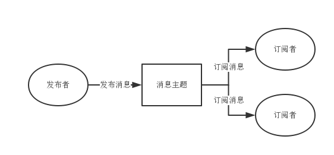
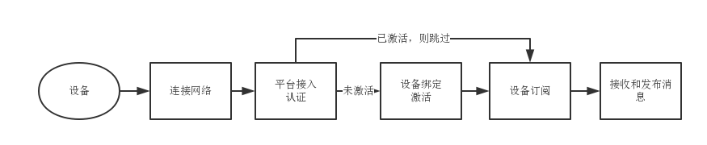
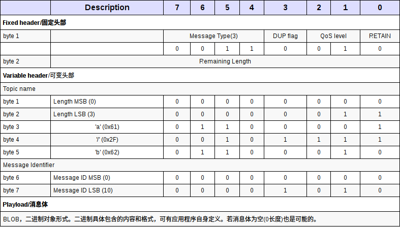

## 文档目标

本文档用于描述得力云平台智能办公场景设备接入的通用标准方式、通信协议以及具体的接口定义，不涉及具体某种类型设备的业务操作协议。

## 适用范围

本文档用于说明得力云平台对外提供的接入方式，帮助和指导智能办公场景下设备产品固件开发人员正确接入云平台。对于本身不支持连接云平台网络的设备不在此文档讨论的范畴。

## 相关术语

|术语|解释|
|----|----|
|智能设备|是指任何一种具有计算处理能力的设备、器械或者机器，智能设备通过网络与云平台连接，实现设备和云端软件服务的集成|
|云平台|各种智能设备和应用服务接入的基础服务平台，为智能设备和云端应用进行接入和数据交换提供支撑|
|应用服务|为智能设备提供增值服务的云端软件应用|

## 通信协议

得力云平台设备接入默认采用目前物联网行业事实上的标准（OASIS）接入协议：MQTT协议，版本号3.1.1。MQTT协议是轻量级的发布和订阅(publish/subscribe)协议，其建立在TCP协议之上，对设备硬件要求低、网络可靠性要求低以及资源消耗要求低的特性为得力云平台未来广泛接入的智能设备提供很好的支持。

与传统的与请求/回答这种同步模式不同，发布/订阅模式解耦了发布消息的客户（发布者）与订阅消息的客户（订阅者）之间的关系，是一种异步消息通信机制，对大量并发提供了更好的支持。



对于数据通信安全性要求较高的设备，可以使用MQTT+SSL的方式接入平台。在设备厂商接入平台前，平台会将设备产品信息录入平台系统，并提供对应的接入网关服务器地址给设备厂商，如果使用SSL通信协议，请向平台申请SSL证书。

MQTT客户端连接库可参考[链接](https://github.com/mqtt/mqtt.github.io/wiki/libraries)。

对于不支持MQTT协议的设备接入，请与平台管理人员联系沟通解决。

## 接入流程

任何一台设备在出厂后，都需要经过联网、认证接入以及绑定激活这三个步骤后方能激活使用。一旦激活成功，即可订阅设备关联的业务主题，并接受相应的发布消息。



所谓设备绑定激活，是指设备完成了与个人或企业组织的绑定关系，同时也对接上相应的云端服务。得力云平台在联网配置、认证接入和绑定激活都有相应的标准流程，具体说明如下：

- ### 设备联网

设备连接网络是接入得力云平台的先决条件，不同配置的设备联网方式不尽相同。主要分为如下几种:

    1.  设备支持自配置联网，无需手机App协助；
    2.  设备支持通过蓝牙进行配网，通过蓝牙与手机App通信完成联网设置；
    3.  设备支持Wifi配网，通过Wifi与手机App通信完成联网设置；
    4.  设备不支持联网，无法进行网络配置；

对于`情况#1`，由于平台无需参与网络配置，可以由设备厂商自行实现联网配置方式，但要求尽量简单。

对于`情况#2`，设备厂商需要将设备蓝牙名称设置为DELI_{产品型号}，方便得力App扫描定位设备。其中产品型号由平台和厂商共同定义，并写入设备固件和云平台，具体通信协议请参考[《得力云设备蓝牙网络配置协议》](../../general/network/ble/index.md)。

对于`情况#3`，设备和App将采用类似微信的AirKiss通信协议方式进行连接，具体通信协议请参考[《得力云设备Wifi网络配置协议》](../../general/network/wifi/index.md)。

对于`情况#4`，主要是指一些小型设备，类似手环、微型打印机等，仅支持蓝牙等方式与APP连接，不能直接连接云平台。这种设备与情况1类似，APP不需要配网处理。

对于需要APP进行联网配置的设备，设备需要在包装盒或者机身上印制二维码，二维码中应包含如下信息：

|二维码信息|描述|
|---|---|
|product|产品型号|
|connType|联网方式: auto/ble/wifi/none|

二维码的信息格式示例参考（最终格式请设备厂商与平台确认）:

** `http://qr.delicloud.com?from=device&action=activate&product=DL3785W&connType=ble `**

其中各参数定义如下:

|参数|描述|
|----|----|
|from|该二维码来源。**device**表示来自智能设备|
|action|二维码对应的操作类型。**activate**表示设备绑定激活|
|product|当二维码来源于设备时，设备的产品型号|
|connType|当二维码来自设备时，设备的配网方式|

一个产品型号所有设备的二维码全部一样。为了防止二维码信息不可识别，产品型号信息建议印刷在设备上，得力云App也支持手动输入产品型号的方式来进行设备联网配置。

设备一旦联网配置成功，应自动连接得力云平台进行接入认证。


- ### 设备接入认证

出于安全考虑，所有支持联网的智能设备都需要经过基本的认证方能接入云平台。云平台采用了MQTT协议的标准认证方式，即根据设备的唯一ID、设备账户以及密码三个信息来判断设备是否可以接入。

目前平台支持两种方式的设备认证:

    1.   设备预先注册认证;
    2.   设备直接注册认证（推荐）

对于`方案#1`，设备厂商需要自行为每一台设备分别生成唯一的账户和密码对，并提前录入云平台进行注册（也可由平台批量生成）。由于每台设备的账户密码唯一，安全性较高，接入可控性更强。缺点是，生产成本较高，接入复杂。

对于`方案#2`，设备不需要预先生成账户和密码对，在设备接入时采用一个平台约定的算法生成合法的账户信息进行接入认证。这种方式安全性较差，但是对生产影响较小，接入方便。

不论采用哪种认证方式，云平台要求设备ID必须全局唯一（两台相同ID的设备不能同时接入平台），由设备厂商自行生成，建议命名格式：** {产品型号}_{厂商设备唯一SN编码} **。例如考勤机型号DL3785W，那么某一台设备唯一编号则建议是DL3785W_1234567890。

关于`方案#2`的认证信息，可以按照如下规则来实现:

|接入参数|描述|
|----|----|
|ClientID|设备唯一ID，格式：{产品型号}_{厂商设备唯一编码}|
|UserName|产品型号|
|Password|MD5(ClientID + “-” + {产品型号} + “-” + {产品密钥})|

其中产品密钥是由云平台注册产品型号时生成，并提供给设备厂商。每个不同的产品型号，生成的产品密钥不同，是一一对应的关系。

** 对于本身不支持连接互联网的设备，由APP与设备之间根据相应的连接协议进行接入认证，具体协议待定。**


- ### 设备绑定激活

通常来讲，所有接入得力云的智能设备都应完成设备绑定激活，才能投入使用。绑定激活操作由得力App操作完成，设备端不需要直接参与，但设备应通过某种方式告知用户APP设备的ClientID。

**(1)对于自配置联网的设备，可通过以下两种方式告知APP设备ID信息:**

    1.   在每台设备印制二维码，二维码中存储每台设备的ID；
    2.   在设备屏幕上，自动根据设备信息生成二维码；（推荐）

`方案1`对生产要求高，除非设备没有屏幕，否则不推荐采用。印制二维码格式如下：

**`http://qr.delicloud.com?from=device&action=activate&product={产品型号}&device={设备ID}&conntype=auto`**

`方案2`操作简单，二维码信息可以动态生成，并携带更多设备状态信息，推荐使用, 生成的二维码信息可以包括:

|二维码信息|描述|
|----|----|
|product|产品型号|
|conntype|配网方式，auto表示自配置|
|device|设备ID|
|status|设备状态。包括未联网（-1）、接入平台成功（0）、接入失败（1）、已绑定（2）|
|error|更多错误描述信息，设备自定义|
|group|绑定组织ID，可选|

设备接入平台如果成功，设备可以选择主动通过接口查询[指令102](#102)查询设备绑定状态，如果已绑定，可以将group信息填充到二维码中。设备本地不建议存储任何绑定信息，以免造成数据不一致。

生成二维码示例(一台已绑定组织ID为1000的设备):

** `http://qr.delicloud.com?from=device&action=activate&product={产品型号}&device={设备ID}&status=2&group=1000` **

**(2)对于通过与App进行蓝牙或者Wifi通信的设备: **

由于其二维码只存储静态信息，设备ID以及状态信息可通过相应的网络通信协议交互完成。

- ### 设备主题订阅

设备在绑定成功后，需要订阅设备产品相关的主题消息（Topic），以便平台向设备发送消息。设备在接入平台后，平台会自动会为该设备订阅一个唯一的主题，用于点对点的设备通信（设备无需主动订阅）。除此之外，设备还可以订阅以下几个全局主题:

|主题|描述|
|----|----|
|{产品类型}|一种业务类型产品的全局消息，例如所有考勤机，定义一个产品类型主题**KQ**。|
|{产品类型}/{产品型号}|一种业务类型产品下某个具体产品型号的全局消息，例如考勤机的某个产品型号DL3785W可订阅主题**KQ/DL3785W**|

除以上主题外，设备无需订阅其他主题，平台设备网关也会拒绝设备订阅。

产品类型与产品型号都是由云平台生成并提供给设备生产商，生产商直接固化该信息到设备程序或配置中即可。

设备订阅了以上两个主题，则平台可以针对某种产品类型或者产品类型下的某个具体产品型号发送全局广播消息，以应对某些特殊场景的需求，例如升级通知。

设备订阅成功后，即可根据MQTT协议接口规则接收异步消息响应，具体消息响应格式将再第三章说明。


- ### 设备消息发布

设备在接入平台之后，可以根据实际业务流程向平台网关发布消息，设备发布主题统一定为**`device`**, 平台会根据接收消息的具体操作指令进行处理或者转发。

## 平台设备接口

设备可通过平台提供的一系列接口指令与平台以及云端应用服务进行通信完成设备的相关业务操作，包括设备通用消息指令、平台通用消息指令以及设备应用交互指令三个部分。

- ### 消息格式

为了便于开发和管理，平台为所有开放接口约定了统一的数据交换格式。首先，按照MQTT通信协议的设计，所有的消息都应有消息主题（Topic name），这里我们约定所有得力云平台设备接口的主题都是**device**。附MQTT数据包格式如下：



平台自定义数据格式都通过MQTT数据包的Payload消息体部分来设计。所有发送和接收到的Payload消息体都是以JSON数据格式存储的字符串，编码格式统一为**UTF-8**。数据格式如下:

``` json
    {
        "mid": "消息ID", 
        "from": "发送者ID", 
        "to": "接收者ID或空", 
        "time": 操作时间（秒）, 
        "action": 操作指令, 
        "data": {具体消息内容 }
    }
```


各属性说明如下:

|属性|描述|
|----|----|
|mid|消息ID，用来标识一次消息请求上下文，数值自定义，平台并不对该消息ID进行处理。|
|from|消息发布者ID。包括设备ID、应用服务ID或者平台system。|
|to|消息接收者ID。包括设备ID、应用服务ID或者平台system。|
|time|消息发布时间，精确到秒|
|action|消息指令。不同指令代表不同的消息操作类型|
|data|具体的消息内容，JSON数据格式|


对于一次完整的消息请求和响应的流程，默认情况下`mid`应相同，请求的`from`和`to`应和响应的`to`和`from`一一对应。另外，`data`字段中响应部分应包含响应错误码和错误描述信息等。

下面就目前开放的所有指令进行具体说明。注意，以下指令并非全部需要支持，设备应根据业务实际情况进行支持，设备厂商应告知平台可以支持的指令列表。


- ### 设备通用指令

以下指令是由设备端主动向平台发起的指令集，设备通过该指令集请求平台数据或通知平台设备状态数据，该指令集所有指令以**1**开头。
针对平台响应，`data`字段统一格式如下:

``` json
{
    ......
    "data": {
        "code": -1, 
        "msg": "错误描述或空", 
        ......
    }
}
```

其中`code`表示[平台响应错误码](#platform_error), 如果响应失败，`msg`将包含错误的具体原因信息。


+ #### <span id="100">时间同步100</span>

设备接入成功后需要进行时间同步，以保证本地时间的准确性。

请求消息示例如下:

``` json
{
    "mid": "123456", 
    "from": "设备ID", 
    "time": 0, 
    "action": 100
}
```

平台响应消息数据为默认响应格式，如下：

``` json
{
    "from": "system", 
    "mid": “123456”, 
    "time": 1502867044, 
    "action": 100, 
    "data": {
        "code": 0
    }
}
```

设备可直接使用响应中的time作为本地时间，精确到秒。如果设备对时间精度有要求，也可以选择得力云的NTP服务(time.delicloud.com)或公共的NTP服务。

+ #### <span id="101">设备信息更新101</span>

设备接入成功后，建议立刻调用该指令告知平台设备相关的信息，后续设备信息发生变化时，也应通过该指令更新设备信息到平台。

请求消息示例如下:

``` json
{
    "mid": "123456", 
    "from": "设备ID", 
    "time": 1502867086, 
    "action": 101, 
    "data": {
        "name": "设备名称", 
        "product_version": "1.0",
        "properties": {
            "p1": "val1", 
            "p2": "val2"
        }
    }
}
```

其中`data`部分的各属性说明如下:

|属性|描述|
|----|----|
|name|设备名称或空|
|product_version|设备产品固件版本号|
|properties|每台设备独特的一些属性参数，设备根据实际情况写入。设备信息中额外属性properties根据设备实际情况填写，如果没有，可不填。|

平台响应消息数据格式与[指令100](#100)类似:
```json
{
    "mid": "123456", 
    "from": "system", 
    "time": 1502867044, 
    "action": 101, 
    "data": {
        "code": 0
    }
}
```

+ #### <span id="102">设备查询102</span>

设备可通过查询指令查询平台记录的设备信息。设备本地可以缓存该信息，但应设置合理的过期时间，防止信息不同步。建议设备每天至少查询一次设备状态，但也不可过于频繁。

请求消息示例如下:

```json
{
    "mid": "123456", 
    "from": "设备ID", 
    "time": 1502867086, 
    "action": 102
}
```
响应消息数据格式:
```json
{
    "mid": "123456", 
    "from": "system", 
    "time": 1502867086, 
    "action": 102, 
    "data": {
        "code": 0, 
        "status": 1,
        "group_id": 绑定组织ID, 
        "last_access": 上次接入时间（秒）, 
        "product_version": "最新固件版本号"
    }
}

```

其中平台响应`data`部分的各属性说明如下:

|属性|描述|
|----|----|
|status|设备状态: 0锁定、1正常|
|group_id|设备已绑定组织ID，如果未绑定，则为空|
|product_version|设备产品固件最新版本|
|last_access|上次接入时间（精确到秒), 初次接入为0|

注意： 如果`group_id`信息为空或者与本地缓存的`group_id`信息不一致，可能是平台已解绑该设备，此时设备应及时清理所有本地业务数据，恢复出厂数据状态。

另外，如果平台固件版本与本地版本不一致，设备应通过[指令103](#103)主动查询平台最新固件版本信息进行升级。


+ #### <span id="103">固件版本查询103</span>

通过该指令，设备可以查询目前该设备所属产品型号的最新固件版本信息以及固件文件下载地址等。
请求消息示例如下:
```json
{
    "mid": "123456", 
    "from": "设备ID", 
    "time": 1502867086, 
    "action": 103
}
```
响应消息数据格式:
```json
{
    "mid": "123456", 
    "from": "system", 
    "time": 1502867086, 
    "action": 103, 
    "data": {
        "code": 0, 
        "version": "1.1", 
        "upgrade_type": "force|normal",  
        "file_path": "http://delicloud.com/oss/xxx.zip", 
        "checksum": "4c56ff4ce4aaf9573aa5dff913df997a"
    }
}
```

各响应属性说明如下:

|属性|描述|
|----|----|
|version|设备所属产品型号最新升级版本|
|upgrade_type|升级类型，包括强制升级（force）和普通升级（normal）。对于强制升级，升级完成之前，设备不可用；否则可按照设备自定义空闲时间进行升级|
|file_path|固件最新升级文件下载地址|
|checksum|固件升级文件的MD5完整性校验值|

设备根据本地版本比较决定是否需要升级，如果需要，则通过`file_path`给定的路径下载文件升级。为了避免集中并发压力过大，**一个产品型号所有设备不要同一时刻启动升级文件下载操作**，建议在某个时间段进行随机生成一个下载启动时间，例如凌晨0点-2点，按照0-7200秒随机。文件下载成功后，应进行本地MD5校验，防止文件损坏造成设备升级失败。

另外，平台也可以主动向设备广播固件新版本变更通知, 参考固件升级通知[指令202](#202)。

注意，由于下载升级文件时采用的HTTP协议，为了避免网络不佳造成无法下载，建议采用[HTTP通用的断点续传下载方案](https://www.w3.org/Protocols/rfc2616/rfc2616-sec3.html#sec3.12)。


+ #### <span id="104">设备主动解绑104</span>

对于安全性要求不高的设备类型，平台通过预授权允许其通过设备端主动完成解绑操作，解绑之后本地业务数据应清理干净。通过该指令设备可主动通知平台解除设备与用户组织的绑定关系。
请求消息示例如下:
```json
{
    "mid": "123456", 
    "from": "设备ID", 
    "time": 1502867086, 
    "action": 104
}
```
响应消息数据为默认响应格式:
```json
{
    "mid": "123456", 
    "from": "system", 
    "time": 1502867044, 
    "action": 104, 
    "data": {
        "code": 0
    }
}
```

**为了保证设备一定解绑成功，在收到平台响应结果之前，设备应处于循环等待状态（如果超时，应重新发起解绑），不能进行其他操作**。
注意，是否需要主动解绑功能，设备开发商可根据设备使用场景决定，但是需要平台对设备产品型号进行预授权。

+ #### 设备异常报警105

通过该指令设备可向平台主动进行设备**系统级别**的（非业务级别的）异常报警。平台会将设备报警消息推送给设备管理员。
请求消息示例如下:
```json
{
    "mid": "123456", 
    "from": "设备ID", 
    "time": 1502867086, 
    "action": 105, 
    "data": {
        "code": 200, 
        "msg": "警报消息"
    }
}
```
设备报警代码`code`由平台和设备开发商协商决定，目前应至少包含固件升级异常、CPU、内存以及硬盘等硬件指标异常等。


- ### 平台通用指令

以下指令是由平台主动发起请求到设备的指令集，通过该指令集可远程控制设备以及获取设备数据。该指令集指令以**2**开头。
其中，如果由用户发起的平台指令，消息体中`from`字段定义为用户ID，设备响应时也应将消息体`to`字段定义为该用户ID。数据响应格式如下:
```json
{
    "mid": "123456", 
    "to": "用户ID", 
    "time": 1502867086, 
    "action": XXX, 
    "data": {
        "code": 0，
        .......
    }
}
```

+ #### <span id="200">设备控制200</span>

用户通过该指令可实现对设备进行远程自定义控制命令下发。不同的设备类型可以支持不同的远程控制命令集，但命令集的定义应与平台进行协商共同决定。该指令主要用于远程设备售后调试用，用户正常使用情况下不需要该指令。

请求消息示例如下:
```json
{
    "mid": "123456", 
    "from": "用户ID", 
    "time": 1502867086, 
    "action": 200, 
    "data": {
        "cmd": "自定义命令", 
        "payload": { }
    }
}
```
设备收到命令后，应给出执行结果并返回。响应消息数据格式:
```json
{
    "mid": "123456", 
    "to": "用户ID", 
    "time": 1502867086, 
    "action": 200, 
    "data": {
        "code": 0, 
        "cmd": "自定义命令", 
        "payload": { }
    }
}
```
请求和响应数据内容除以上固定字段外，`cmd`和`payload`内容可根据实际情况自定义。

+ #### <span id="201">设备日志上传通知201</span>

平台通过该指令可以控制设备进行日志上传操作，用于远程售后故障分析。日志文件上传默认采用FTP协议。
请求消息示例如下:
```json
{
    "mid": "123456", 
    "from": "用户ID", 
    "time": 1502867086, 
    "action": 207, 
    "data": {
        "ftp_host": "ftp.delicloud.com", 
        "log_start": "日志开始日期或空",
        "log_end": "日志结束日期或空",
    }
}
```

其中`ftp_host`表示日志上传的ftp地址，`log_start`和`log_end`表示上传的日期间隔，日期格式为**yyyy-MM-dd**, 例如2017-08-10。
上传完成后，响应消息数据格式:
```json
{
    "mid": "123456", 
    "to": "用户ID", 
    "time": 1502867086, 
    "action": 201, 
    "data": {
        "code": 0, 
    }
}
```
如果上传失败，应设置`code`为201，并给出具体的错误原因。

+ #### <span id="202">设备固件升级通知202</span>

当平台发布了某种产品型号的固件升级版本时，平台会通过该指令广播通知所有该产品型号的设备进行升级。
通知消息格式如下:
```json
{
    "mid": "123456", 
    "from": "", 
    "time": 1502867086, 
    "action": 202, 
    "data": {
        "version": "1.1"
    }
}
```
设备收到该通知后，如果判断版本不一致需要升级，应通过[指令103](#103)查询升级版本信息，并根据随机升级时间策略进行下载升级文件。

+ #### <span id="203">组织绑定通知203</span>

平台通过该指令通知设备与用户组织绑定状态的更新。
通知消息格式如下:
```json
{
    "mid": "123456", 
    "from": "用户ID", 
    "time": 1502867086, 
    "action": 203, 
    "data": {
        "group_id": xxxxxx, 
        "name": "组织名称", 
        "status": 0|1
    }
}
```
`status`等于0表示设备和用户组织已解绑，`status`等于1代表设备和组织已绑定。

**注意，一旦设备和用户组织绑定关系发生变化，其本地缓存的历史业务数据需要及时清理**。对于平台解绑操作，设备可能不在线，为了保证解绑成功，设备再次接入平台时，必须主动清除本地业务数据。

如果设备本地并未存储历史业务数据和绑定关系信息，可直接忽略该通知。


+ #### <span id="204">应用绑定通知204</span>

平台通过该指令通知设备与云端应用的绑定状态的更新。
通知消息格式如下:
```json
{
    "mid": "123456", 
    "from": "用户ID", 
    "time": 1502867086, 
    "action": 204, 
    "data": {
        "service_id": xxxxx, 
        "name": "服务名称", 
        "icon": "服务图标URL", 
        "status": 0|1
    }
}
```
`status`等于0表示设备和某个云端应用已解绑，`status`等于1代表设备和某个云端应用已绑定。
注意，设备与应用的绑定关系更新只是设备与云端应用业务层面上的状态更新，并不影响设备归属用户组织的关系。如果设备本地并未存储应用关联关系，可忽略该通知消息。

+ #### <span id="205">用户授权登录通知205</span>

对于某些特殊设备，例如PPT翻页笔，需要用户授权才能够正常使用。通过该指令可实现APP进行远程授权验证并通知设备授权成功。
通知消息格式如下:
```json
{
    "mid": "123456", 
    "time": 1502867086,  
    "action": 205, 
    "data": {
        "status": 0|1|2, 
        "user_id": "用户ID", 
        "name": "用户姓名", 
        "mobile": "手机号码", 
        "avatar": "用户头像URL", 
        "expire": "token失效时间", 
        "token": "请求token"
    }
}
```
其中`status`为0表示用户已扫码待确认状态，1则表示用户确认授权成功，其它表示授权失败。在`status`为0时，不返回`expire`和`token`信息。


- ### 设备应用交互指令

设备除了与平台之间的基本通信指令之外，更多的是与云端应用软件之间的消息交互。不同的设备产品类型，其交互的内容完全不同，平台仅提供指令进行消息转发，定义如下:

+ #### <span id="300">设备推送消息到应用300</span>

所有设备发布到云端应用的消息均通过该指令来完成。平台收到该指令消息后，会进行预处理并转发到云端应用。
请求消息示例如下:
```json
{
    "mid": "123456", 
    "to": "应用服务ID或空", 
    "time": 1502867086, 
    "action": 300, 
    "data": {
        "cmd": "业务操作命令", 
        "payload": {}
    }
}
```
其中，`to`表示目标应用服务ID，如果为空，则发送给当前绑定的所有应用服务。另外，`data`字段中`cmd`和`payload`为固定参数，`cmd`表示具体的业务类型，`payload`则表示自定义的请求参数。

如果平台验证消息失败，会停止消息转发并直接返回如下响应:
```json
{
    "mid": "123456", 
    "from": "system", 
    "time": 1502867044, 
    "action": 300, 
    "data": {
        "cmd": "业务操作命令", 
        "code": 错误码, 
        "msg": "错误描述"
    }
}
```

如果平台验证通过，应用服务对设备返回响应，应采用下一节[指令301](#301)。

+ #### <span id="301">应用推送消息到设备301</span>

所有云端应用服务发布到设备的消息在经过平台验证通过后，都会由平台通过该指令来完成消息转发到设备。其中`from`字段表示发送消息的云端应用ID。

平台转换后的请求消息格式如下:
```json
{
    "mid": "123456", 
    "from": "应用服务ID", 
    "time": 1502867086, 
    "action": 301, 
    "data": {
        "cmd": "业务操作命令", 
        "payload": {}
    }
}
```
设备收到消息后，如果需要返回响应，请使用[指令300](#300)。


## 接入环境

设备接入环境分测试环境和生产环节。其中测试环境的MQTT协议固定接入点是: **`tcp://t.device.delicloud.com:1883`**。

对于正式环境，设备默认可通过**`tcp://device.delicloud.com:1883`**进行接入，但是建议设备通过HTTP协议动态获取可用的接入点信息。HTTP配置请求地址如下:

**`http://d.delicloud.com/access_list` **

响应结果为JSON格式，内容如下:
```json
{
    "MQTT": [
        "tcp://d1.delicloud.com:1883", 
        "tcp://d2.delicloud.com:1883"
    ]
}
```

如果动态接入点配置接口访问失败，则采用默认配置进行连接。

## 其它

- ### <span id="platform_error">平台统一错误码</span>

|错误码(code)|描述(msg)|
|----|----|
|-1|平台未定义错误，由msg字段描述具体原因|
|0|平台操作成功|
|100|请求参数解析错误|
|101|请求签名不正确|
|102|请求目标不存在或无法送达|
|103|请求权限不足|
|104|请求过期|
|105|请求方已被封禁|
|106|不支持的操作指令|
|107|设备未注册或未绑定|
|200|设备报警码：设备升级失败|
|201|设备报警码：设备日志上传失败|
|202|设备报警码：设备硬件异常|


- ### 更新日志

  ** 1.0 (2017-10-24) **

  + 发布1.0线上版本


