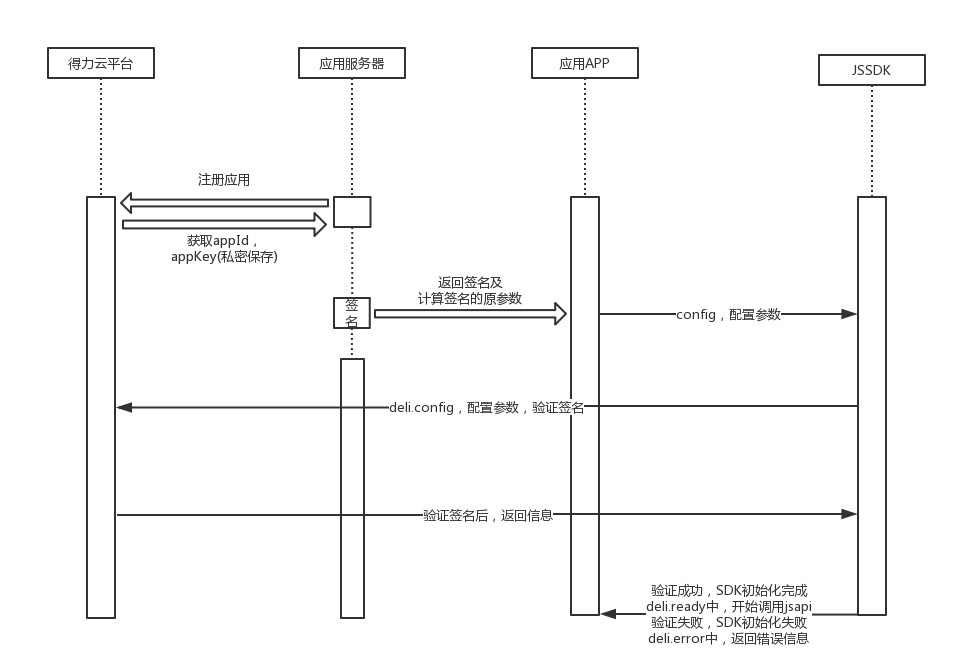

## 文档目标

本文档用于描述基于HTML5网页形式的第三方云应用服务接入得力APP,如何通过JS API接口与原生APP进行交互.

## 适用范围

所有基于HTML5形式的第三方云应用开发人员均可通过本文档了解得力云智慧办公APP开放的JS API接口功能以及调用方法.

## 使用简介

- ### 1. 页面引入JS文件

在需要调用JS接口的页面引入delicloud.min.js文件,引入地址如下:

** `http://cdnjs.delicloud.com/delicloud.min.js` **

备注:引入JS后会得到全局变量** deli **,支持使用AMD/CMD标准模块加载方法加载.

- ### 2. JSAPI初始化配置

+ #### JSAPI初始化过程

    * 注册应用,应用服务端从得力云平台获取`appId`和`appKey`,其中`appKey`是私密信息,应保存在应用服务器中,不得公开;
    * 应用服务端在页面初始化时根据平台提供的签名算法和私密信息计算签名（具体算法见下一小节）,并将签名结果和生成签名的原参数返回给前端页面;
    * 前端页面调用**deli.config**配置接口输入应用服务器传递过来的签名信息进行平台授权验证; 注意,**deli.config**不要重复配置;
    * 平台验证应用服务器的签名信息并返回验证结果.如果验证失败,SDK会调用**deli.error**方法返回错误信息,否则会调用**deli.ready**,SDK初始化完成.



+ #### JSAPI初始化签名算法

第三方应用服务使用得力云提供的JSAPI时需要验证其调用身份.验证方法是采用简单的签名算法来完成.由于`appKey`是平台和应用服务之间的私密信息,通过采用相同的`appKey`计算出来的签名如果一致,则可证明应用服务的合法性.
签名生成的规则如下:

```javascript
var keyArray = sort(noncestr,timestamp,appId,appKey);
var str = assemble(keyArray);
var signature = md5(str);
```

参与签名的字段包括在上文中获取的`appId`, `noncestr`（随机字符串）,`timestamp`（当前时间戳,具体值为当前时间到1970年1月1号的秒数）.
具体的计算过程描述如下:

    步骤1. sort()含义为对所有待签名参数按照字段名的ASCII码从小到大排序（字典序）;
    步骤2. assemble()含义为根据步骤1中获的参数字段的顺序,使用键值对的格式（即key1=value1&key2=value2…）拼接成字符串;
    步骤3. md5()的含义为对在步骤2拼接好的字符串进行md5加密.

- ### 3. SDK初始化

**deli.config**是所有需要使用JS-SDK的页面首先需要调用的初始化配置操作.如果配置验证不成功,后续所有接口将无法使用.（注意,同一个url仅需调用一次）
```javascript
deli.config({
    appId : "", //必填,应用ID
    timestamp : "", //必填,生成签名的时间戳
    nonceStr : "", //必填,生成签名的随机字符串
    signature : "", //必填,签名
    jsApiList : []  //必填,所有需要使用的JS接口名称列表,JS接口名称在章节三中,例如:"["common.navigation.setTitle","common.navigation.setRight","common.navigation.close"]".
})
```

- **deli.config**调用成功后,SDK会自动调用**deli.ready**方法表示SDK已初始化完毕,可以开始使用SDK的API接口.该方法定义如下:
```javascript
deli.ready(function(){
    // deli.ready 参数为回调函数,在环境准备就绪时触发,
    //jsapi的调用需要保证在该回调函数触发后调用,否则无效.
});
```

- **deli.config**如果验证失败,则自动调用**deli.error**方法,SDK初始化失败并返回具体的错误信息.
该方法定义如下:
```javascript
deli.error(function(resp){
    // config信息验证失败会执行error函数,
    //如签名过期导致验证失败,可以在返回的resp参数中查看参数内容并和生成签名参数做对比,找出错误的参数
    { "code" : "错误码", "msg" : "错误信息描述" }
});
```


- ### 4. 其它说明

    + 所有接口都通过deli对象来调用;
    + 所有接口都为异步;
    + 所有接口的调用方式是都是统一的,由三个参数组成.第一个参数是一个object类型,表示请求参数信息,第二个参数是成功回调函数,第三个参数是失败回调函数.示例如下:

```javascript
deli.common(模块分类).function(功能).method(方法)(
    {}, //第一个参数,object类型
function(data){
    //第二个参数,成功回调
},function(resp){
    //第三个参数,失败回调
});
```

成功时返回接口响应数据,不同接口格式不同,具体见各个接口定义.
失败时返回失败的错误码和错误信息描述,默认响应格式如下:
```json
{
    "code": -1,
    "msg": "权限校验失败"
}
```
响应参数说明如下:

|响应参数|说明|
|----|----|
|code|错误码,具体错误码列表见末尾|
|msg|错误信息描述|


## 接口定义

以下接口为得力JS SDK目前开放的所有接口列表,包括通用API接口和与得力云平台业务相关的业务API接口两大类.

- ### 通用接口（common）

+ #### 设置标题（common.navigation.setTitle）
应用使用过程中,需要修改导航栏标题时调用;
```javascript
deli.common.navigation.setTitle({
    "title":"页面标题" //页面标题
}, function(data){}, function(resp){});
```
请求参数说明如下:

|请求参数|说明|
|----|----|
|title|页面标题|

正确时无返回内容, 失败时返回具体错误码和错误描述.

+ #### 设置右侧导航（common.navigation.setRight）
应用使用过程中,需要修改右侧导航文字,设置导航为图标;
```javascript
deli.common.navigation.setRight({
    "text": "确认",   //文字
    "icon":"http://www.delicloud.com/logo.png"//图标url
},function(data){},function(resp){});
```
请求参数说明如下:

|请求参数|说明|
|----|----|
|text|显示文字,请确保text与icon不同时存在,如果同时存在默认显示text|
|icon|显示图标,请确保text与icon不同时存在,如果同时存在默认显示text|

正确时无返回内容, 失败时返回具体错误码和错误描述.

+ #### 关闭webview（common.navigation.close）
应用使用过程中,需要直接关闭webview返回原生入口时调用,
```javascript
deli.common.navigation.close();
```
该方法无请求参数和回调函数.

+ #### 显示loading(common.notification.showPreloader)
应用使用过程中,需要显示loading时调用;
```javascript
deli.common.notification.showPreloader();
```
该方法无请求参数和回调函数.

+ #### 关闭loading(common.notification.hidePreloader)
应用使用过程中,需要关闭loading时调用;
```javascript
deli.common.notification.hidePreloader();
```
该方法无请求参数和回调函数.

+ #### 提示toast(common.notification.toast)
应用使用过程中,需要提示文本信息时调用;
```javascript
deli.common.notification.toast({
    "text": "提示信息", //提示信息
    "duration": 5, //提示时间,单位为秒
},function(data){},function(resp){});
```
请求参数说明如下:

|请求参数|说明|
|----|----|
|text|提示信息|
|duration|非必填,提示信息显示时间,单位为秒|

正确时无返回内容, 失败时返回具体错误码和错误描述.

+ #### 上传图片（common.image.upload）
应用需要上传图片时调用,可拍照或从手机相册中选择上传;
```javascript
deli.common.image.upload({
    "type": "album" //从相册中选择
},function(data){},function(resp){});
```
请求参数说明如下:

|请求参数|说明|
|----|----|
|type|非必填,上传图片方式.album表示仅从相册选择,camera表示仅支持相机拍照,未填写则表示均支持|

正确时返回示例如下:
```json
{
    "url": "base64" 
}
```
响应参数说明如下:

|响应参数|说明|
|----|----|
|url|返回图片BASE64格式编码|

失败时返回具体错误码和错误描述.

+ #### 预览图片（common.image.preview）
应用需要预览图片时调用;
```javascript
deli.common.image.preview({
    "current": 0,
    "urls":[
    "http://www.nbdeli.com/formwork/default/images/case-new-1.jpg",
    "http://www.nbdeli.com/formwork/default/images/case-li-img.jpg",
    "http://www.nbdeli.com/formwork/default/images/case-li-img4.jpg",
    "http://www.nbdeli.com/formwork/default/images/case-li-img3.jpg"
    ]//图片地址列表
},function(data){},function(resp){});
```
请求参数说明如下:

|请求参数|说明|
|----|----|
|current|非必填,预览图片索引,默认从0开始|
|urls|图片地址列表|

正确时无返回内容, 失败时返回具体错误码和错误描述.

+ #### 上传文件(common.file.upload)
应用需要上传文件时调用;
```javascript
deli.common.file.upload({},function(data){},function(resp){});
```
正确时返回结果如下:
```json
{
    "name": "logo.png",
    "url": "http://www.delicloud.com/logo.png"
}
```
响应参数说明如下:

|响应参数|说明|
|----|----|
|name|文件名称|
|url|文件URL链接地址|

失败时返回具体错误码和错误描述.

+ #### 查看地理位置（common.location.open）
应用需要原生内置地图查看地理位置时调用;
```javascript
deli.common.location.open({
    "latitude": "30.50",
    "longitude": "114.33",
    "name": "武汉市",
    "address": "武汉市洪山区",
    "scale": "18"
},function(data){},function(resp){});
```
请求参数说明如下:

|请求参数|说明|
|----|----|
|latitude|纬度,浮点数,范围为90~-90|
|longitude|经度,浮点数,范围为180~-180|
|name|位置名|
|address|详情地址说明|
|scale|地图缩放级别.整形值,范围从1~28.默认为16|

正确时原生内置地图显示地理位置信息(无返回内容), 失败时返回具体错误码和错误描述.

+ #### 获取地理位置（common.location.get）
应用需要原生内置GPS获取地理位置时调用;
```javascript
deli.common.location.get({},function(data){},function(resp){});
```
正确时返回示例如下:
```json
{
    "latitude": "",
    "longitude": "",
    "name": "" ,
    "address": "" 
}
```
响应参数说明如下:

|响应参数|说明|
|----|----|
|latitude|纬度,浮点数,范围为90~-90|
|longitude|经度,浮点数,范围为180~-180|
|name|位置名|
|address|详情地址说明|

失败时返回具体错误码和错误描述.

+ #### 分享（common.message.share）
应用需要通过原生APP分享内容时调用;
```javascript
deli.common.message.share(
{
    "title": "消息标题",
    "desc": "分享内容",
    "link": "http://www.delicloud.com/",
    "img_url": "http://www.delicloud.com/logo.png"
},function(data){},function(resp){});
```
请求参数说明如下:

|请求参数|说明|
|----|----|
|title|分享标题|
|desc|分享内容|
|link|分享链接URL|
|img_url|分享图片URL|

正确时无返回内容, 失败时返回具体错误码和错误描述.

+ #### 手机震动（common.phone.vibrate）
```javascript
deli.common.phone.vibrate();
```
该方法无请求参数和回调. 调用成功后,自动触发手机进行震动.

+ #### 获取网络类型（common.connection.getNetworkType）
```javascript
deli.common.connection.getNetworkType({},function(data){},function(resp){});
```
无请求参数, 正确时返回示例如下:
```json
{
    "network_type": "wifi",
}
```
响应参数说明如下:

|响应参数|说明|
|----|----|
|network_type|返回网络类型,包括:*2g,3g,4g,wifi*|

失败时返回具体错误码和错误描述.

+ #### 获取手机唯一识别码（common.phone.getUUID）
```javascript
deli.common.phone.getUUID({},function(data){},function(resp){});
```
无请求参数, 正确时返回示例如下:
```json
{
    "uuid": "uuid123456"
}
```
响应参数说明如下:

|响应参数|说明|
|----|----|
|uuid|手机唯一识别码UUID|

失败时返回具体错误码和错误描述.

+ #### 获取手机接入的热点信息（common.phone.getInterface)
```javascript
deli.common.phone.getInterface({},function(data){},function(resp){});
```
无请求参数, 正确时返回示例如下:
```json
{
    "ssid": "DELI",
    "local_mac": "",
    "local_ip": "",
    "mac": "a0:ab:1b:6e:f2:38",
    "ip": "" 
}
```
响应参数说明如下:

|响应参数|说明|
|----|----|
|ssid|热点名称|
|local_mac|手机mac地址|
|local_ip|手机ip地址|
|mac|热点设备mac地址|
|ip|热点设备ip地址|

失败时返回具体错误码和错误描述.


- ### APP业务接口（app）

+ #### 添加智能设备（app.device.bind）
应用使用过程中, 需要添加并绑定新的智能设备时调用;
```javascript
deli.app.device.bind({},function(data){},function(resp){});
```
无请求参数. 添加设备完成后, 正确时返回示例如下:
```json
{
    "device_id": "10001",
    "name": "设备名",
    "product": "产品型号",
    "icon": "产品图标URL" 
}
```

响应参数说明如下:

|响应参数|说明|
|----|----|
|device_id|设备ID|
|name|设备名称|
|product|产品型号|
|icon|产品图标|

失败时返回具体错误码和错误描述.

+ #### 获取用户信息（app.user.get）
应用需要获取用户信息时调用; 如果`user_id`为空，则返回当前用户信息.
```javascript
deli.app.user.get({"user_id":349944153787858944},function(data){},function(resp){});
```
请求参数说明如下:

|请求参数|说明|
|----|----|
|user_id|用户ID|

正确时返回示例如下:
```json
{
    "data":{
        "user":{
            "id": "349944153787858944" ,
            "name": "张三",
            "avatar": "http://static.delicloud.com/user/avatar.jpg",
            "gender": "1",
            "birthday": "1993-11-11",
        },
        "organization":[{
            "id": "349944153787858944",
            "name": "组织名称",
            "type": "组织类型:企业或个人",
            "icon": "组织图标URL",
            "is_admin": true
        }]
    }
}
```
响应参数说明如下:

|响应参数|说明|
|----|----|
|data|响应数据|
|user|用户信息: *<br>id:用户ID,<br>name:用户名称,<br>avatar:用户头像,<br>gender:用户性别,1是男性,0是女性,<br>birthday:用户生日*|
|organization|所属组织信息: *<br>id:所属组织ID,<br>name:所属组织名称,<br>type:组织类型,<br>icon:所属组织图标URL,<br>is_admin:是否是该组织管理员;*|

失败时返回具体错误码和错误描述.

+ #### 获取组织信息（app.organization.get）
应用需要获取组织信息时调用; 如果`org_id`为空，则返回当前组织信息.
```javascript
deli.app.organization.get({"org_id":349944153787858944},function(data){},function(resp){});
```
请求参数说明如下:

|请求参数|说明|
|----|----|
|org_id|用户组织ID|

正确时返回示例如下:
```json
{
    "data":{
        "organization":{
            "id": "349944153787858944",
            "name": "组织名称",
            "type": "组织类型:企业或个人",
            "icon": "组织图标URL",
        }
    }
}
```
响应参数说明如下:

|响应参数|说明|
|----|----|
|data|响应数据|
|organization|组织信息: *<br>id:组织ID,<br>name:组织名称,<br/>type:组织类型,<br>icon:组织图标URL*|

失败时返回具体错误码和错误描述.


+ #### 打电话（app.user.telephoneCall）
应用使用过程中,需要打电话给某个指定用户时调用;
```javascript
deli.app.user.telephoneCall(
    {"user_id": "362618666346348544"},
function(data){},function(resp){});
```
请求参数说明如下:

|请求参数|说明|
|----|----|
|user_id|用户ID|

正确时自动拨通用户注册的用户号码, 失败时返回具体错误码和错误描述;

+#### 打开聊天会话（app.user.chatOpen）
```javascript
deli.app.user.chatOpen(
    {"user_ids":["355672617635545088","362618666346348544"]},
function(data){},function(resp){});
```
请求参数说明如下:

|请求参数|说明|
|----|----|
|user_ids|参与聊天会话的用户ID列表|

正确时弹出原生的聊天窗口, 失败时返回具体错误码和错误描述.

+ #### 选择企业通讯录中的人（app.user.select）
应用如果需要选择组织中的人员,可调用本接口弹出原生组织通讯录窗口，从指定可选的顶级部门范围内选择,如未设置可选的顶级部门,则默认在组织的最顶级部门中选择;
```javascript
deli.app.user.select({
    "title":"选择企业通讯录中的人",
    "mode":"multi", //多选
    "root_dept_id":"355671868335718401",//设置可选顶级部门的Id
    "max":200,  //选择人数限制
    "selected_user_ids":["355672617635545088","362618666346348544"],//已选的用户
    "disabled_user_ids":["355672596013907968","360009358211284992"]//禁止选择的用户
},
function(data){},function(resp){});
```
请求参数说明如下:

|请求参数|说明|
|----|----|
|title|页面标题|
|mode|必填,选择模式,single表示单选,multi表示多选|
|root_dept_id|设置可选顶级部门的ID|
|max|选择人数限制|
|selected_user_ids|默认已选择用户的ID列表. 如果默认选中的用户不在指定的顶级部门之下,则自动忽略|
|disabled_user_ids|禁止选择用户的ID列表|

正确时返回示例如下:
```json
{
    "data":[
        {
        "user_id": "355672596013907968",
        "name": "delicoud",
        "avatar": "http://static.delicloud.com/user/avatar.jpg",
        "empno": "100" 
        },
        {
        "user_id": "360009358211284992",
        "name": "delicoud2",
        "avatar": "http://static.delicloud.com/user/avatar.jpg",
        "empno": "" 
        }
    ]
}
```
响应参数说明如下:

|响应参数|说明|
|----|----|
|user_id|用户ID|
|name|用户姓名|
|avatar|用户头像|
|empno|工号|

失败时返回具体错误码和错误描述.


+ #### 选择企业通讯录中的部门（app.department.select）
应用如果需要选择组织通讯录中的部门,可调用本接口弹出组织通讯录，从指定可选的顶级部门范围内选择,如未设置可选的顶级部门,则默认在组织的最顶级部门中选择;
```javascript
deli.app.department.select({
    "title":"选择企业通讯录中的部门",
    "mode":"multi", //多选
    "root_dept_id":"355671868335718401",//设置可选顶级部门的Id
    "max":200,  //选择部门数限制
    "selected_dept_ids":["355671868335718404","355678628404527106"],//已选的部门
    "disabled_dept_ids":["355678628404527106","355678749540220928"]//禁止选择的部门
},
function(data){},function(resp){});
```
请求参数说明如下:

|请求参数|说明|
|----|----|
|title|页面标题|
|mode|必填,选择模式,single表示单选,multi表示多选|
|root_dept_id|设置可选顶级部门的ID|
|max|选择部门数限制|
|selected_dept_ids|默认已选择部门的ID列表,如果默认选中的部分不在设置的顶级部门之下,则自动忽略|
|disabled_dept_ids|禁止选择部门的ID列表|

正确时返回示例如下:
```json
{
    "data":[
        {
            "dept_id": "355671868335718401",
            "dept_name": "研发部",
        },
        {
            "dept_id": "355671868335718404",
            "dept_name": "设计部"
        }
    ]
}
```
响应参数说明如下:

|响应参数|说明|
|----|----|
|dept_id|部门ID|
|dept_name|部门名称|

失败时返回具体错误码和错误描述.

## 其它

- ### 错误码定义列表（待定义）

|错误码|错误码说明|
|----|----|
|-1|权限校验失败|
|-2|参数错误|
|-3|网络错误|
|-4|未知错误|

- ### 更新日志

  ** 1.0 (2017-10-26) **

  + 发布1.0线上版本
